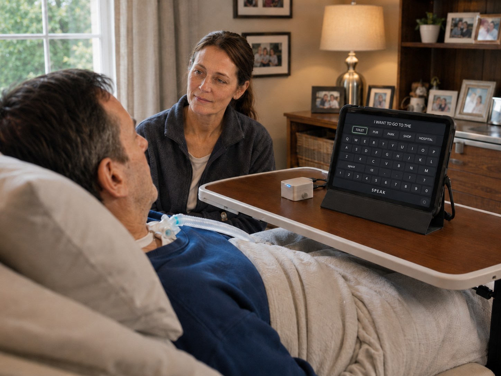
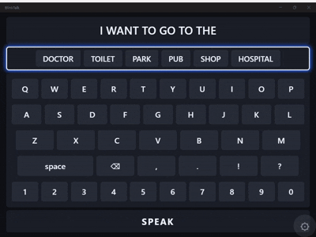
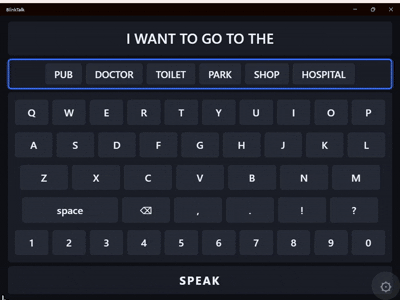
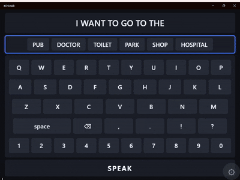

# BlinkTalk

Written for a friend with locked-in syndrome.

BlinkTalk is a single-switch [AAC](https://en.wikipedia.org/wiki/Augmentative_and_alternative_communication)
(augmentative and alternative communication) app. A helper points the screen at the person they wish to
communicate with and taps the screen whenever the person indicates (blinks, looks up, whatever they prefer).
From that single signal, the person can spell out letters, pick whole words, and speak complete sentences aloud.

On Desktop computers the assistant can press the `Space` Bar on the keyboard, or click
the left mouse button anywhere on the app.

*All platforms allow the user to indicate using a facial gesture such as looking up or blinking.*



## How it works

The screen continuously **scans** - it highlights one option at a time on a timer. A user or helper indication "selects"
whatever happens to be highlighted at that moment.

The whole screen is the button: the helper can tap anywhere on touch screen devices, click
anywhere on the screen using a mouse (desktop), press the `Space` bar on the keyboard,
or the app can observe the user via the device camera and detect when they indicate.

Selecting moves through a hierarchy of scanners:

1. **Section** — choose between picking a suggested word, opening the keyboard, or speaking the sentence.



2. **Word suggestions** — instead of spelling a whole word, pick from predicted words.




3. **Keyboard** — scan to a row of keys, then to a column, to land on a single letter.



To keep typing fast, BlinkTalk predicts what the person is most likely to say next. A bundled dictionary
plus a word-sequence (n-gram) model learns the person's vocabulary and phrasing over time, so frequently
used words and natural word combinations are offered first.

## Projects

The solution (`BlinkTalk.sln`) has three projects under `Source/`:

- **`BlinkTalk.Application`** (`netstandard2.0`) — all the scanning, prediction, and persistence logic.
  Contains no MAUI or Blazor types, so it can be unit-tested on plain .NET. Platform concerns enter only
  through interfaces (text-to-speech, settings, clock, UI dispatch, the database).
- **`BlinkTalk`** — the .NET MAUI Blazor Hybrid host (Android, iOS, Mac Catalyst, Windows). Holds the
  Razor UI, the platform implementations of those interfaces, and the bundled `English.db` dictionary.
- **`BlinkTalk.Application.Tests`** — xUnit tests for the logic library.

## Build & run

Requires the [.NET SDK](https://dotnet.microsoft.com/download) with the MAUI workload installed
(`dotnet workload install maui`). iOS and Mac Catalyst builds need a Mac host.

```bash
# Run the tests (the primary fast feedback loop)
dotnet test Source/BlinkTalk.Application.Tests/BlinkTalk.Application.Tests.csproj

# Build / run the app on Windows
dotnet run --project Source/BlinkTalk/BlinkTalk.csproj -f net10.0-windows10.0.19041.0

# Deploy + run on a connected Android device or emulator
dotnet build Source/BlinkTalk/BlinkTalk.csproj -t:Run -f net10.0-android
```

> Always pass `-f <target-framework>` when building the `BlinkTalk` app. Building the whole solution on
> Windows fails because the iOS / Mac Catalyst targets require a Mac.

## Settings

The scan speed (how long each option stays highlighted) is adjustable in-app on the Settings screen, so it
can be tuned to the user's ability.
